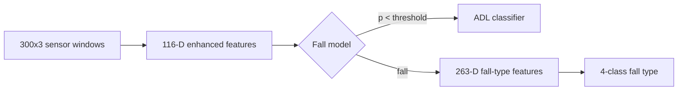

# SisFall / MobiAct — system architecture

This document ties together **training** (`scripts/`), **frozen weights** (`models/`), **evaluation outputs** (`results/`), **real-time inference** (backend + Flutter), and the **product surfaces** (caretaker / elder / admin).

## 1. Repository layout (verification-friendly)

| Area | Purpose |
|------|---------|
| `scripts/baseline_fall/` | 116-D enhanced features, fall-binary training, preprocessing, plots |
| `scripts/baseline_adl/` | ADL multiclass training + viz |
| `scripts/baseline_falltype/` | 263-D fall-type raw vector, MI selection, 4-class training + viz |
| `scripts/inference/` | **Canonical** `load_artifacts` + `run_inference` (also re-exported by `flask_backend/app/services/motion_xgb_service.py`) |
| `scripts/run_training.py` | One entrypoint: `fall-detection`, `adl`, `fall-type`, `all`, `sync-manifest` |
| `models/` | Only **exported** joblibs + `inference_manifest.json` (paths + dimensions) |
| `results/` | CSV + figures produced by training scripts (safe to regenerate) |

Run full training stack after placing MobiAct under `--data-root`:

```bash
set PYTHONPATH=scripts
py scripts/run_training.py all --data-root "path\to\MobiAct_Dataset_v2.0\Annotated Data"
```

Then refresh manifest dimensions:

```bash
py scripts/sync_inference_manifest.py
```

## 2. Inference pipeline (sensor → backend)

Intended flow:

1. **Mobile (Flutter)** collects a sliding window of accelerometer / gyroscope / orientation samples (300 samples × 3 axes per modality where available).
2. **On-device** it computes **116-D enhanced features** (`motion_feature_extractor.dart`) matching `scripts/baseline_fall/enhanced_features.py`.
3. **POST** `/api/v1/inference/motion` with:
   - `enhanced_features`: length = manifest `enhanced_feature_dim` (116).
   - Optional **sensor windows** (`acc_window`, `gyro_window`, `ori_window`) when fall-type should run **server-side** without sending 263 floats from the phone.
4. **Backend** (`scripts/inference/motion_pipeline.py`):
   - Scales 116-D → **fall binary** probability.
   - If **not fall**: scales same 116-D → **ADL** label.
   - If **fall**: builds **263-D** fall-type vector from windows (or uses client-provided `fall_type_features`) → **4-class fall type**.



## 3. Product: three dashboards (target design)

The Flutter app already implements a **caregiver** vs **patient (elder)** shell with monitoring, alerts, and alarms. The roadmap below extends that into three explicit **roles**:

### Caretaker (up to two elders)

- Live view of assigned elders’ activity label + fall probability (from backend).
- When a fall is detected: see alert + predicted fall type; coordinate with elder confirmation UI.
- **Capacity**: one caretaker actively monitoring **two** elders (enforce in backend assignment service when you add auth).

### Elder (wearable / phone)

- On fall detection: **modal** with responses (examples): *Okay*, *Need help*, *No fall (false alarm)*, *Fell but wrong type*, *Correct type*, *No help needed*.
- **Timeout ladder**: no answer → local alarm → still no answer → **emergency escalation** to caretaker (push/SMS per deployment).
- Each choice is **timestamped** and sent to the backend for storage (model QA + future retraining).

### Admin

- Cross-cutting metrics: caretakers, elders, latency (sensor → prediction), precision/recall proxies from logged feedback, **concept drift** signals (e.g. distribution shift on 116-D or residual error rates over time).

### Feedback logging (stub API)

`POST /api/v1/events/fall-feedback` appends JSON lines to `data/feedback/fall_events.jsonl` (folder gitignored by `/data/`). Replace with PostgreSQL or your cloud store for production.

## 4. Related frontend files

| File | Role |
|------|------|
| `app_frontend/lib/src/motion_feature_extractor.dart` | 116-D parity with Python |
| `app_frontend/lib/src/motion_inference_helper.dart` | Packages windows + calls inference API |
| `app_frontend/lib/src/roles/app_roles.dart` | Role enum + roadmap notes for three dashboards |

## 5. Single source of truth for dimensions

`models/inference_manifest.json` — updated by `scripts/sync_inference_manifest.py` after you replace scalers.
